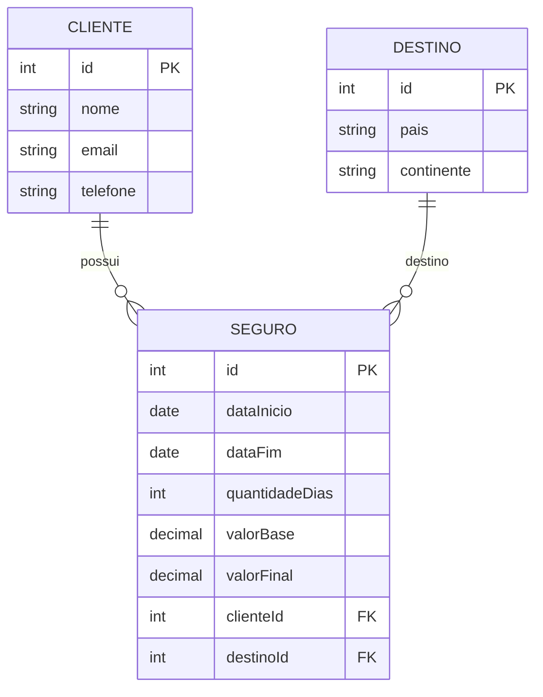

# 🛫 API de Seguro de Viagem

## 📌 Descrição do Projeto

Este projeto consiste no desenvolvimento de uma **API RESTful** para gerenciamento de **seguros de viagem**, construída utilizando **Node.js**, **TypeScript**, **NestJS** e **TypeORM**.

O sistema permite cadastrar clientes, destinos e seguros de viagem, aplicando regras de negócio para calcular automaticamente o valor do seguro com base na quantidade de dias da viagem e no destino escolhido.

Este projeto foi desenvolvido como parte de um **bootcamp de desenvolvimento backend**, com foco em boas práticas de arquitetura, organização de código e aplicação de regras de negócio em APIs.

---

## 🎯 Objetivo

Criar um CRUD completo para gerenciamento de seguros de viagem, aplicando regras de negócio reais e preparando a aplicação para evoluções futuras, como integração com APIs externas.

---

## 🧰 Tecnologias Utilizadas

* Node.js
* TypeScript
* NestJS
* TypeORM
* SQLite ou PostgreSQL
* REST API

---

## 🏗️ Arquitetura do Projeto

A aplicação segue a arquitetura padrão do **NestJS**, baseada em módulos.

```
src
│
├── cliente
│   ├── cliente.controller.ts
│   ├── cliente.service.ts
│   ├── cliente.module.ts
│   └── entities
│       └── cliente.entity.ts
│
├── destino
│   ├── destino.controller.ts
│   ├── destino.service.ts
│   ├── destino.module.ts
│   └── entities
│       └── destino.entity.ts
│
├── seguro
│   ├── seguro.controller.ts
│   ├── seguro.service.ts
│   ├── seguro.module.ts
│   └── entities
│       └── seguro.entity.ts
│
└── database
    └── data-source.ts
```

---

## 🗄️ Diagrama Entidade-Relacionamento (DER)



### 📌 Descrição dos Relacionamentos

* Um **Cliente** pode possuir vários **Seguros**
* Um **Destino** pode estar associado a vários **Seguros**
* Um **Seguro** pertence a um único **Cliente**
* Um **Seguro** possui um único **Destino**

---

## 🗄️ Modelo de Dados (Entidades)

### Cliente

* id
* nome
* email
* telefone

### Destino

* id
* pais
* continente

### Seguro

* id
* dataInicio
* dataFim
* quantidadeDias
* valorBase
* valorFinal
* clienteId
* destinoId

---

## 📐 Regras de Negócio

### 1. Cálculo do Valor do Seguro

O valor do seguro é calculado com base na quantidade de dias da viagem.

```
Valor base por dia: R$ 10

valorBase = quantidadeDias × valorPorDia
```

### 2. Regra Especial para Destinos

Se o destino for:

* USA
* Canada

Será aplicado um acréscimo de **20%** sobre o valor final.

```
valorFinal = valorBase × 1.2
```

Caso contrário:

```
valorFinal = valorBase
```

---

## 🚀 Endpoints da API

### Cliente

```
POST   /clientes
GET    /clientes
GET    /clientes/:id
PUT    /clientes/:id
DELETE /clientes/:id
```

---


## 🔮 Melhorias Futuras (Roadmap)

Esta seção representa evoluções planejadas para tornar o sistema mais realista e próximo de um ambiente de produção.

### 1. Integração com API de Distância entre Localidades

Uma melhoria futura será integrar a aplicação com uma API externa que forneça a distância entre a origem e o destino da viagem.


#### Objetivo

Utilizar a distância da viagem como fator adicional no cálculo do valor do seguro.


### 2. Autenticação e Autorização (JWT)

Implementar controle de acesso utilizando:

* Login
* Registro de usuários
* Token JWT
* Guards

Objetivo:

Permitir que apenas usuários autenticados possam criar e consultar seguros.

---

### 3. Documentação com Swagger

Adicionar documentação automática da API.

Benefícios:

* Testar endpoints diretamente no navegador
* Facilitar integração com front-end
* Melhorar experiência de desenvolvimento


---

## 🧠 Aprendizados Demonstrados no Projeto

Este projeto demonstra conhecimento em:

* Criação de APIs REST com NestJS
* Organização modular
* Uso de TypeScript
* Uso de TypeORM
* Relacionamento entre entidades
* Implementação de regras de negócio
* Boas práticas de desenvolvimento backend

---

👥 Equipe
Product Owner: José Javier/Samara Ferreira
Scrum Master: Marlos Santos
Desenvolvedores: Mariana Soares, Mirelly Santos, João Brito.
QA Tester: Henrique Ferreira 
